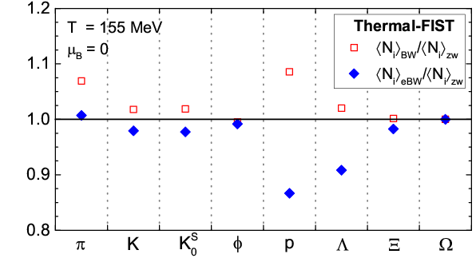

## Description

This repository contains the source code for calculations presented in the paper https://arxiv.org/abs/1807.02079

Calculations are performed within the [Thermal-FIST](https://github.com/vlvovch/Thermal-FIST) package which is used in this repository as a submodule.
Therefore, it is advisable to use the `--recurse-submodules` option when cloning this repository in order to also clone the `Thermal-FIST` submodule automatically 

There are two C++ scripts in the repository, located in the [src](src) folder:
- [1807.02079.TDep.cpp](src/1807.02079.TDep.cpp) - calculates the temperature dependence of the modified hadron yields. This corresponds to the contents of Sec. III of the paper.
- [1807.02079.Fits.cpp](src/1807.02079.Fits.cpp) - performs thermal fits to ALICE data at different centralities (Sec. IV of the paper).

Both scripts are annotated and can be generalized for other applications.

## Usage
The preferred way is to use `cmake`.

On a Unix-like system one can run the following commands from the root project folder to build the programs:
```bash
mkdir build
cd build
cmake ../
make 1807.02079.TDep
make 1807.02079.Fits
```

This will build the aforementioned `1807.02079.TDep` and `1807.02079.Fits` executables in the `build` folder.
The dependent `Thermal-FIST` library will also be built.

#### Temperature dependence

Running
```
./1807.02079.TDep
```
will generate two output files:
- `ZeroWidth-vs-BW-vs-eBW-vs-T.dat` - contains the temperature dependence of the ratios of various hadron yields calculated in the BW or eBW scheme over the yields calculated in the zero-width approximation. The generated data are plotted in Figs. 1 and 2a of the paper.
- `Widths-p-to-pi-vs-T.dat` - temperature dependence of the proton-to-pion ratio calculated in the three schemes considered for modeling resonance widths. This is plotted in Fig. 2b of the paper.

The figures below depict the calculation results.

|   |   |
|:-------------------------:|:-------------------------:|
| Fig. 1 | Fig. 2b


#### Thermal fits

Running
```
./1807.02079.Fits
```
will perform the thermal fits within the three considered schemes to the hadron yield data of the ALICE collaboration at different centralities. 
The program will output `*.txt` and `*.out` files for each fit containing, respectively, the fit log and the resulting data-to-model comparison of hadron yields.
These fit results are shown in Figs. 3 and 4, and in Table II of the paper.
The fitted data are located in the [input/data](input/data) folder.

Alternatively, one can perform the fits within the `QtThermalFIST` gui program included in the `Thermal-FIST` submodule. See more details [here](https://github.com/vlvovch/Thermal-FIST/blob/master/docs/quickstart.md).

<p align="center">
  
</p>

## Attribution
The code here implements calculations from the following paper:

- V. Vovchenko, M.I. Gorenstein, H. Stoecker, *Finite resonance widths influence the thermal-model description of hadron yields*, [Phys. Rev. C **98**, 034906 (2018)](https://doi.org/10.1103/PhysRevC.98.034906), [arXiv:1807.02079 [nucl-th]](https://arxiv.org/abs/1807.02079).

Please include a reference to this paper when using this code or its derived version.

*Copyright (C) 2018  Volodymyr Vovchenko*
